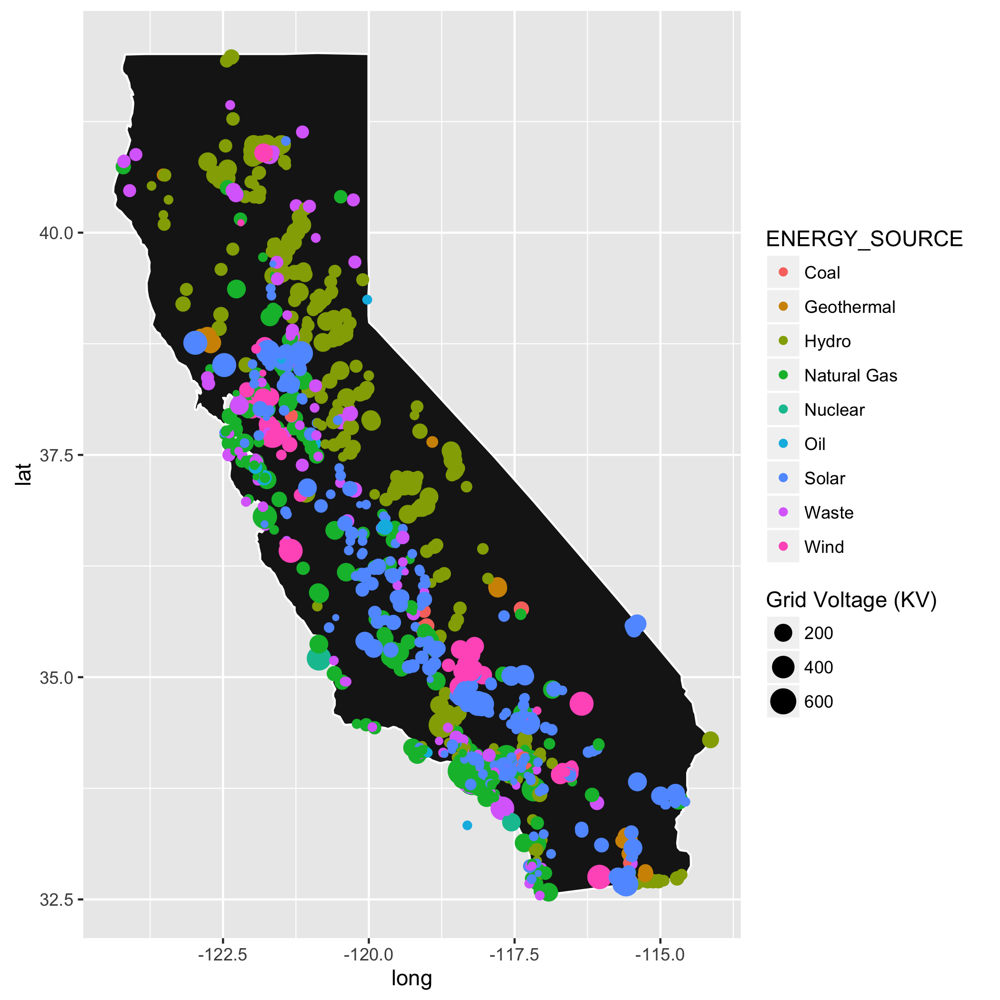
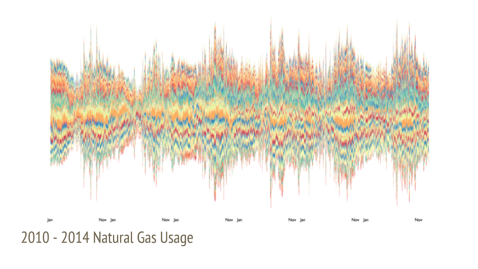
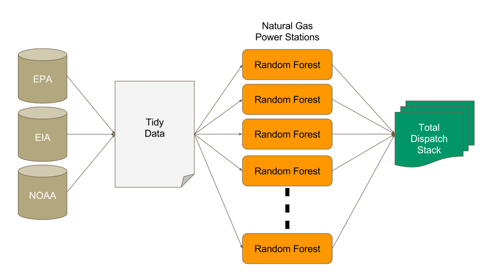
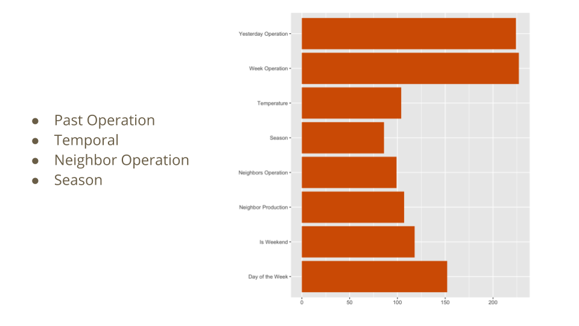
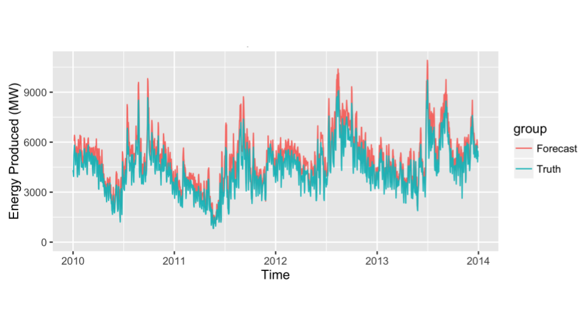
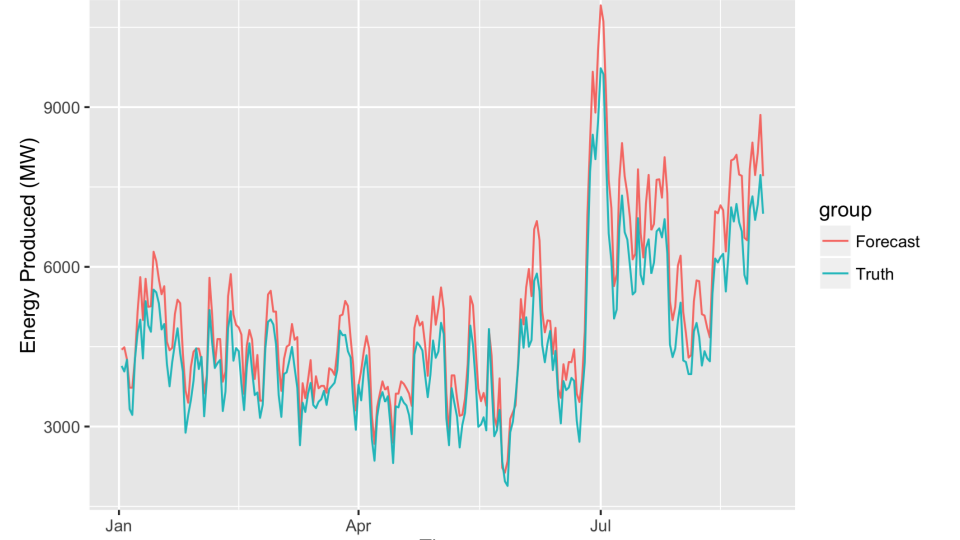

# Energy Load Forecasting

Data cleaning and model forecasting of energy generation.

### Data Sources

* Environmental Protection Agency - Emissions and Activity Data (AMPD)
* Energy Information Administration - Generator Metadata
* National Oceanic and Atmospheric Administration - Temperature Data

## California Power Plants

* Mostly Closed Energy Market
* Expansive Grid
* Publicly Available Data

 

Focused on **Natural Gas** plants as they feature:

* Detailed Available Data
* Flexible Supply
* Not Directly Dependent on Environment Conditions

 

## Data Shape

From 2010 - 2014, for every Power Station, for every Day

* Active
* Operation Statistics, Past
* Location (Longitude/Latitude)
* Local Weather, Past and Forecast
* Production Capacity
* Date

### Feature Engineering

Derived the following features about each plants' day:

* Day of the Week
* Weekend
* Season
* Recent Operating History
  * Past Day
  * Past Week

And based on geographic location:

* Local Neighborhood of nearest 3 Power Stations
  * Mean Production Capacity
  * Mean Production of Past Day
  * Mean Production of Past Week

### Random Forest Models

For every plant, the code trains a random forest model. This was done by best subset selection of the available features, judging the model quality with a 5 fold cross-validated balanced error rate between the two classes of _ACTIVE_ and _INACTIVE_.

| Name                          | Model                                                                     | Active Accuracy | Inactive Accuracy | Balanced Error Rate |
|-------------------------------|---------------------------------------------------------------------------|-----------------|-------------------|---------------------|
| Magnolia                      | ~ WEEKDAY + GRID_NEIGHBORS + OP_TIME_LAG + OP_TIME_MA                     | 0.988           | 0.97              | 0.02                |
| Coalinga Cogeneration Company | ~ WEEKEND + GRID_NEIGHBORS + OP_TIME_NEIGHBORS + OP_TIME_LAG + OP_TIME_MA | 0.996           | 0.943             | 0.03                |
| Average                       |                                                                           | 0.677           | 0.937             | 0.192               |

